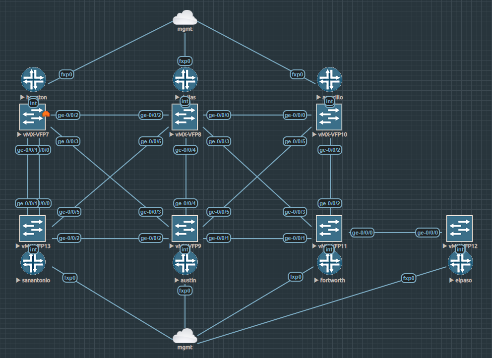

# Juniper Telemetry Demo

Welcome to the repository that manages the [documentation](https://cdot65.github.io/juniper-telemetry-demo/) for my Juniper Telemetry demo. In this demonstration, we will deploy [jtimon](https://github.com/nileshsimaria/jtimon) as a container to ingest JTI telemetry from Juniper vMX routers

## Documentation Site

For all information about this project, please reference the [documentation page](https://cdot65.github.io/juniper-telemetry-demo/).

## Topology Used

We are leveraging EVE-NG to deploy an MPLS network on Juniper vMX routers. These devices will act as the source of our telemetry information, to be received by the jtimon container running somewhere else.

